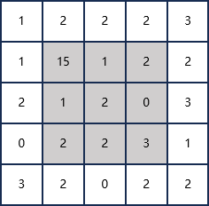
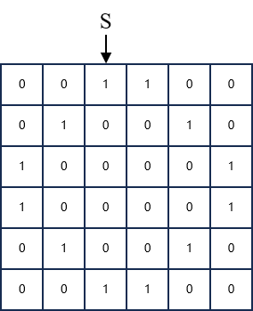
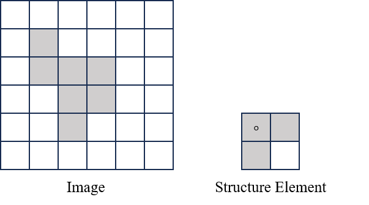

# 2025 年春数字图像处理期末考试回忆版

## Q1 (12 Points)

(1) Given a grayscale image with 16 grey levels. Please use **average filter** and **median filter** to process the image.(**Note: You only need to process the pixels with gray background.**)

## Q2 (20 Points)

(1) **Image Histogram**.

- (a) What is image histogram? (2 Points)
- (b) Image histogram is useful. Please give some examples to show the image histogram usefulness.(**Note: at least three examples**) (6 Points)

(2) **Image Segmentation**.

- (a) Describe the main idea of OTSU segmentation method and its main advantages. (3 Points)
- (b) Describe the main idea of Canny segmentation method and its main advantages. (3 Points)

(3) **Image Representation**.

What is Euler number? Calculate the Euler number of letters **A, B, C**. (6 Points)

## Q3 (18 Points)

Given the following binary image.

(a) Use **4-directional** and **8-directional** chain code to represent the image. (6 Points)

(b) Normalize the chain codes with respect to the starting point. (6 Points)

(c) Nomalize the chain codes by **the first difference** of the chain codes. (6 Points)

**Note: S denotes the starting point.**

## Q4 (14 Points)

Given a grayscale image. Give the steps to do following processing with original image.

(a) Reduce noise by using "Low pass" frequency filter. (7 Points)

(b) Enhance edge by using "High pass" sptial filter "Laplacian". (7 Points)

## Q5 (18 Points)

Given a binary image and structure element.

(a)  Give the morphological erosion result by using the structure element. (6 Points)

(b) Give the morphological dilation result by using the structure element. (6 Points)

(c) Give the opening operation result by using the structure element. (6 Points)

## Q6 (18 Points)

Given a string "bookkeeper".

(a) Complete the following table by using Huffman Coding. Give the detail process of the coding steps. (9 Points)

(b) Calculate the **average length**, **compression ratio** and **code redundancy** of the Huffman Coding compared to the fixed-length coding. (9 Points)

| Char | Probability | Code |
| ---- | ----------- | ---- |
| e    |             |      |
| o    |             |      |
| k    |             |      |
| b    |             |      |
| p    |             |      |
| r    |             |      |

