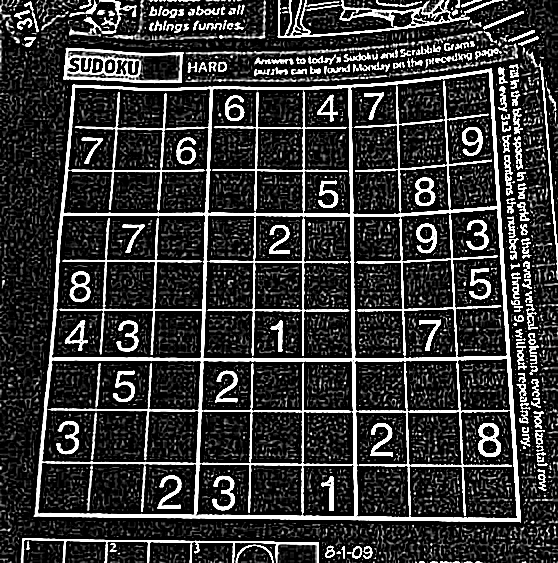

# DIP Project 1

## Image Enhancement

Please select an image enhancement algorithm that you have learned, and use it to sharpen the following [sudoku](./images/sudoku.png) image, highlighting the edges and details. The expected result after enhancement is as follows.

## Morphology

In some applications, we need to remove noise from an image to make the content clearer. Morphological algorithms can solve this problem very conveniently, and you are required to realize it without using the already built morphology libraries. Given a image, please design a morphological algorithm to remove noise from the image. The expected result after morphological processing is as follows.

## Attention

(1)  The programing language is not limited (e.g., MWORKS, Python etc.).

(2)  You cannot call any third party library for key processing steps, but functions use to I/O images, visualization or do mathematics are allowed. Take python as an example, you cannot call any function from cv2 except I/O functions in cv2 or visualization functions in cv2 and you can use numpy to do mathematics.

(3)  You need to submit the source code and a brief report in English (Report template is given).

