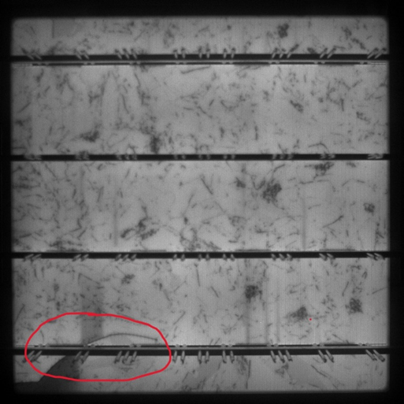

# DIP Project 2

## Introduction

Photovoltaic Cells, commonly referred to as solar cells, are devices that convert sunlight into electrical energy. Typically made from silicon materials, photovoltaic cells undergo a series of intricate processing and surface treatment steps during their manufacturing process. The production of photovoltaic cells includes the purification of silicon materials, the cutting of silicon wafers, the preparation of the cells themselves, the passivation of surfaces, and the application of anti-reflective coatings. Throughout the manufacturing process, photovoltaic cells are subjected to high-temperature treatments, diffusion doping, screen printing, and firing operations to form photovoltaic devices capable of converting light energy into electrical energy.

Photovoltaic cells are widely used in various fields, including residential, commercial, and industrial electricity supply, solar power stations, charging for portable electronic devices, and various remote monitoring and communication devices. They are a core component of renewable energy technologies and play a significant role in promoting the development of green energy and reducing carbon emissions.

During the production of photovoltaic cells, strict quality control is required to ensure their conversion efficiency and long-term stability. To guarantee the performance of photovoltaic cells, it is essential to conduct defect detection to identify and eliminate defects that may affect cell performance, such as cracks, dark spots, and broken grid lines.

## Task Requirements

Defect detection of photovoltaic cells is an important task, which mainly includes the following detection contents, as shown in Figure 1:

1. Identify the cracks in the image. (Basic requirements)
2. Mark the cracks in the image. (Bonus）
3. Output the starting and ending positions of the cracks. (Bonus)

Calculate the approximate length of the cracks. (Bonus)

This project includes four different detection samples. You need to mark the cracks in the images, output the starting and ending positions of the cracks, and calculate the length of the cracks.

## Attention

(1)  The programing language is not limited and this time you can call third party functions.

(2)  You can try any traditional methods you want to improve your detection performance. Although Neural Networks seem to perform well in feature extraction, please **DO NOT use any NN-related method** to do feature extraction. If you **refer** **to** others’ papers, please **attach your references list** at the end of your report.

(3)  For this project you can work in teams, each team **is up to 2-3 classmates**. Each group needs to submit the source code and a brief report **in English**. Please use the **report template** in folder.

(4)  Please list the contribution of each member at the end of the report.

